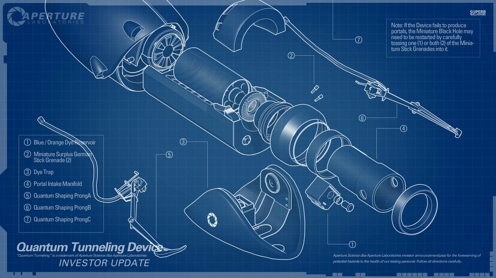
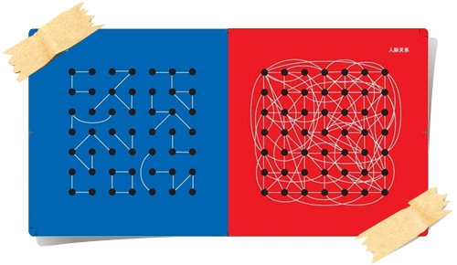
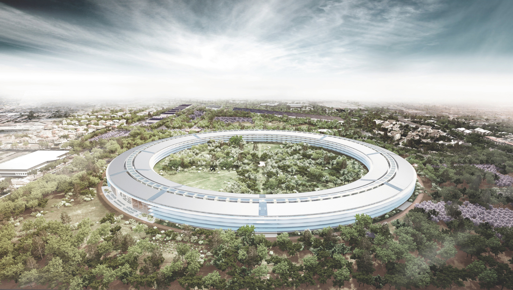
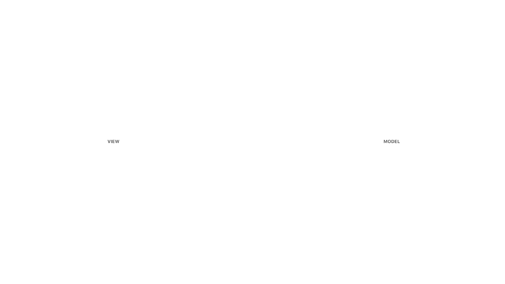
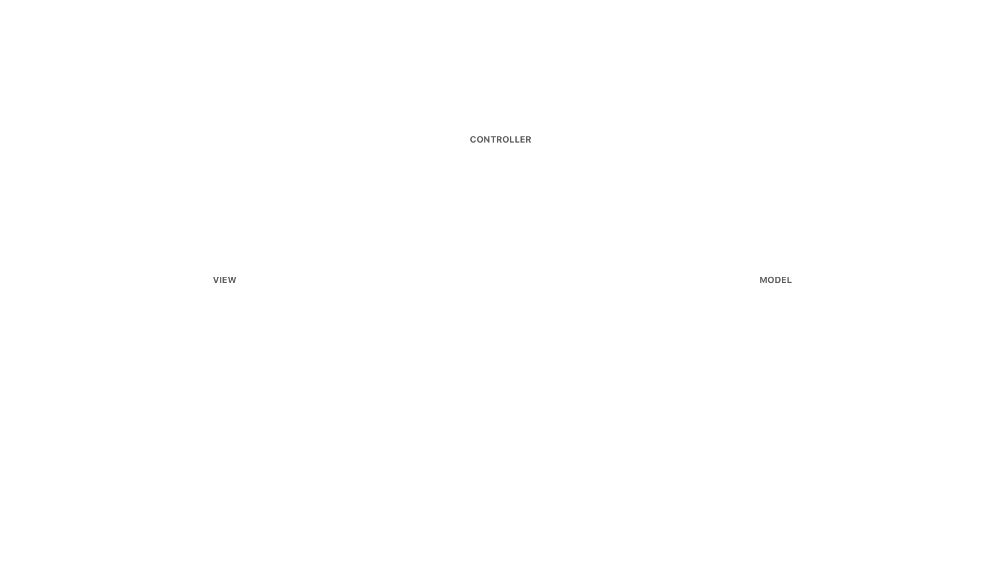
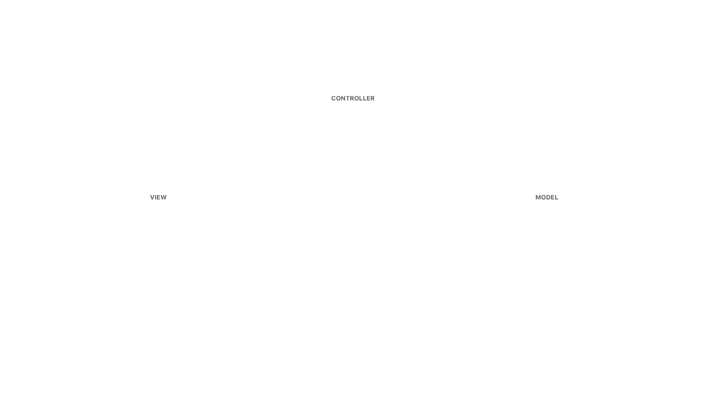
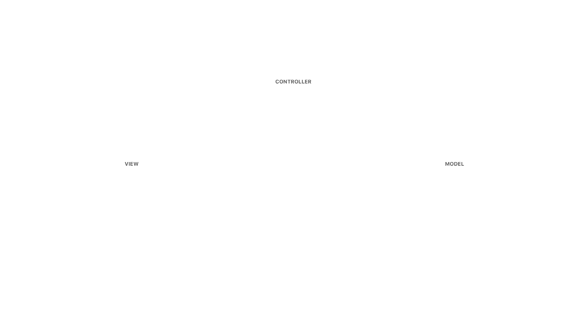
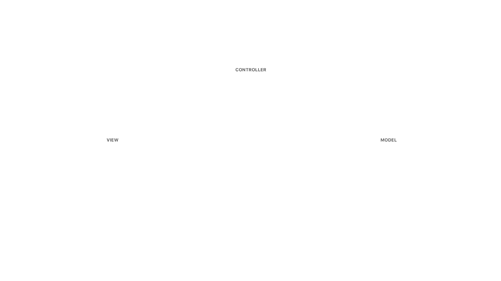
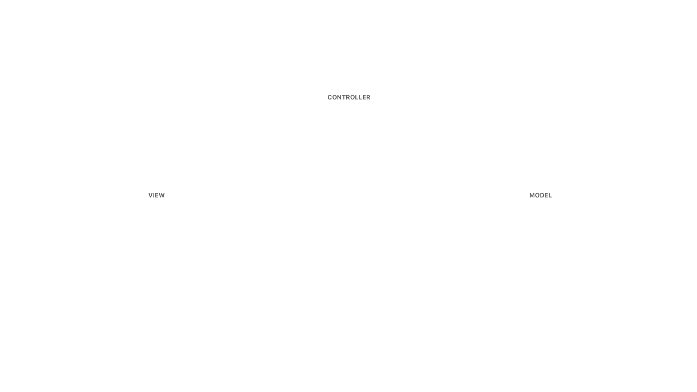

#### TALK TITLE

^ notes

---

#### **what is software architecture?**

---

##### **(as told by pasta)**

---

###### Why Care?

---

### **Testability**

---

#### **easy to change**

---

---

#[fit] 😭

---

#### **decoupling layers**

---

## **simplicity vs complexity**

---

### **cognitive load**

---

##  _**TESTABILITY**_

---

#[fit] **architecture patterns**

---

#[fit] MV*

---

# ****

---

# **MVC**

---

---

---

---

# **models**

---

### **represents the data**

---

#[fit] **NOTHING ELSE**

---

---

---

---

---

#### MassiveViewController

---

lighter view controllers[^1]

[^1]: [objc.io: #1 lighter view controllers](https://www.objc.io/issues/1-view-controllers/lighter-view-controllers/)

---

## MVVM

---

### images to show

---

# VIPER

---

### images to show

---

---

### The problem

---

### Coupled Modules

---

### A POSSIBLE SOLUTION

---

# MVIPCERVM

---

# MVIPCERVM™

---

(kidding)

---

Not a replacement

---

## What was I looking for?

