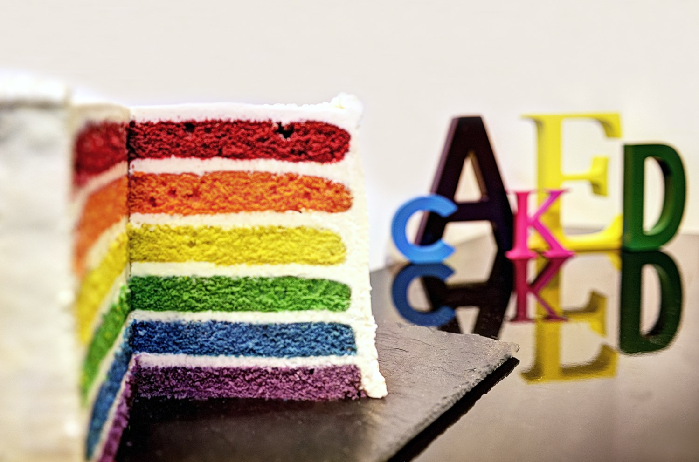

build-lists: true


^ notes

---


A developers tale

---

Jeff Boek

---

PDX CocoaHeads

---

ios-developers.io

---

Opal Labs

---


#### **what is software architecture?**

^ The highest-level breakdown of a system into its parts;
The decisions that are hard to change;
What is architecturally significant can change over a system’s lifetime
It’s the important stuff.

^ To boil it down. It’s how major elements / components interact

---


##### **(as told by pasta)**

---


TL;DR

it's important

---


###### Why Care?

---


### **Testability**

---


#### **easy to change**

---


---


#[fit] 😭

---


#### **decoupling layers**

---


## **simplicity vs complexity**

---


### **cognitive load**

---


##  _**TESTABILITY**_

---


#[fit] **architecture patterns**

---


#[fit] MV*

---


# ****

---


# **MVC**

---


---


---


---


---


---


---


---

# 💁🏽
##[fit] contrived examples ahead...

---

```swift
class RegistrationViewController: UIViewController {
  @IBOutlet weak var usernameLabel: UILabel!
  @IBOutlet weak var emailLabel: UILabel!
  @IBOutlet weak var passwordLabel: UILabel!
  @IBOutlet weak var confirmPasswordLabel: UILabel!
  @IBOutlet weak var submitButton: UIButton!

  init()
}
```

---

### **validations**

```swift
class RegistrationViewController: UIViewController {
  ...
  // validation...
  func passwordIsStrongEnough() -> Bool
  func passwordsDoMatch() -> Bool
}
```

---

### **networking**

```swift
class RegistrationViewController: UIViewController {
  ...
  // validation...
  func passwordIsStrongEnough() -> Bool
  func passwordsDoMatch() -> Bool

  // networking...
  func checkToSeeIfUsernameExists(username: String, callback: Bool -> Void)
}
```

---

### **navigation**

```swift
class RegistrationViewController: UIViewController {
  ...
  // validation...
  func passwordIsStrongEnough() -> Bool
  func passwordsDoMatch() -> Bool

  // networking...
  func checkToSeeIfUsernameExists(username: String, callback: Bool -> Void)

  // navigation...
  func pushViewController(viewController: UIViewController, animated: Bool)
}
```

---

### **data binding**

```swift
class RegistrationViewController: UIViewController {
  ...
  // validation...
  func passwordIsStrongEnough() -> Bool
  func passwordsDoMatch() -> Bool

  // networking...
  func checkToSeeIfUsernameExists(username: String, callback: Bool -> Void)

  // navigation...
  func pushViewController(viewController: UIViewController, animated: Bool)

  // bindings...
  ...
  usernameLabel.text = model.username
  emailLabel.text    = model.email
  ...
}
```

---

### **manipulating the model**

```swift
class RegistrationViewController: UIViewController {
  ...
  // validation...
  func passwordIsStrongEnough() -> Bool
  func passwordsDoMatch() -> Bool

  // networking...
  func checkToSeeIfUsernameExists(username: String, callback: Bool -> Void)

  // navigation...
  func pushViewController(viewController: UIViewController, animated: Bool)

  // binding...
  ...
  usernameLabel.text = model.username
  emailLabel.text    = model.email
  ...

  // model manipulation...
  ...
  model.email    = "jeff@jeffboek.com"
  model.password = "i_like_cake"
  ...
}
```

---

### **view management**

```swift
class RegistrationViewController: UIViewController {
  ...
  // validation...
  func passwordIsStrongEnough() -> Bool
  func passwordsDoMatch() -> Bool

  // networking...
  func checkToSeeIfUsernameExists(username: String, callback: Bool -> Void)

  // navigation...
  func pushViewController(viewController: UIViewController, animated: Bool)

  // binding...
  usernameLabel.text = model.username
  emailLabel.text    = model.email

  // model manipulation...
  model.email    = "jeff@jeffboek.com"
  model.password = "i_like_cake"

  // view management
  func viewDidLoad()
  ...
}
```

---

### **UI events**

```swift
class RegistrationViewController: UIViewController {
  ...
  // validation...
  func passwordIsStrongEnough() -> Bool
  func passwordsDoMatch() -> Bool

  // networking...
  func checkToSeeIfUsernameExists(username: String, callback: Bool -> Void)

  // navigation...
  func pushViewController(viewController: UIViewController, animated: Bool)

  // binding...
  usernameLabel.text = model.username
  emailLabel.text    = model.email

  // model manipulation...
  model.email    = "jeff@jeffboek.com"
  model.password = "i_like_cake"

  // view management
  func viewDidLoad()

  // UI events
  @IBAction func handleSubmitButtonPressed(sender: UIButton)
  ...
}
```

---

#### let's not get started with:

### **protocol conformance**

```swift
class RegistrationViewController: UIViewController,
  NSFetchedResultsControllerDelegate, UIViewControllerTransitionDelegate,
  UITViewControllerAnimatedTransitioning, UITableViewDataSource, UITableViewDelegate, UITextViewDataSource {
  ...
}
```

---

# 5,000 lines later...

---


#### **MassiveViewController**


---

There are solutions to all of these[^1]

[^1]: [objc.io: #1 lighter view controllers](https://www.objc.io/issues/1-view-controllers/lighter-view-controllers/)

---

But is there a better way?

---


## MVVM

---


---


---


---


---


---

#[fit] CODE

---

```swift
class RegistrationViewModel {
  ...
}
```

---

```swift
class RegistrationViewModel {
  ...
}

class RegistrationViewController: UIViewController,
NSFetchedResultsControllerDelegate, UIViewControllerTransitionDelegate, UITViewControllerAnimatedTransitioning,
UITableViewDataSource, UITableViewDelegate, UITextViewDataSource {
  var viewModel: RegistrationViewModel?

  // validation...
  func passwordIsStrongEnough() -> Bool
  func passwordsDoMatch() -> Bool

  // networking...
  func checkToSeeIfUsernameExists(username: String, callback: Bool -> Void)

  // navigation...
  func pushViewController(viewController: UIViewController, animated: Bool)

  // binding...
  usernameLabel.text = model.username
  emailLabel.text    = model.email

  // model manipulation...
  model.email    = "jeff@jeffboek.com"
  model.password = "i_like_cake"

  // view management
  func viewDidLoad()

  // UI events
  @IBAction func handleSubmitButtonPressed(sender: UIButton)
  ...
}
```

---

```swift
class RegistrationViewModel {
  ...
  // validation...
  func passwordIsStrongEnough() -> Bool
  func passwordsDoMatch() -> Bool
}

class RegistrationViewController: UIViewController,
NSFetchedResultsControllerDelegate, UIViewControllerTransitionDelegate, UITViewControllerAnimatedTransitioning,
UITableViewDataSource, UITableViewDelegate, UITextViewDataSource {
  var viewModel: RegistrationViewModel?

  // networking...
  func checkToSeeIfUsernameExists(username: String, callback: Bool -> Void)

  // navigation...
  func pushViewController(viewController: UIViewController, animated: Bool)

  // binding...
  usernameLabel.text = model.username
  emailLabel.text    = model.email

  // model manipulation...
  model.email    = "jeff@jeffboek.com"
  model.password = "i_like_cake"

  // view management
  func viewDidLoad()

  // UI events
  @IBAction func handleSubmitButtonPressed(sender: UIButton)
  ...
}
```

---

```swift
class RegistrationViewModel {
  ...
  // validation...
  func passwordIsStrongEnough() -> Bool
  func passwordsDoMatch() -> Bool

  // networking...
  func checkToSeeIfUsernameExists(username: String, callback: Bool -> Void)
}

class RegistrationViewController: UIViewController,
NSFetchedResultsControllerDelegate, UIViewControllerTransitionDelegate, UITViewControllerAnimatedTransitioning,
UITableViewDataSource, UITableViewDelegate, UITextViewDataSource {
  var viewModel: RegistrationViewModel?

  // navigation...
  func pushViewController(viewController: UIViewController, animated: Bool)

  // binding...
  usernameLabel.text = model.username
  emailLabel.text    = model.email

  // model manipulation...
  model.email    = "jeff@jeffboek.com"
  model.password = "i_like_cake"

  // view management
  func viewDidLoad()

  // UI events
  @IBAction func handleSubmitButtonPressed(sender: UIButton)
  ...
}
```

---

```swift
while !viewControllerEmpty {
  moveLogicFromViewControllerToViewModel()
}
```

---


---

1. Better place for logic to live
1. Further decouples UI from logic.
1. You can share ViewModels across platforms
1. TESTABILITY

---

# VIPER

---


#### **backronym**

```
back·ro·nym (noun)

a fanciful expansion of an existing acronym or word, such
as “VIPER" for
```

---


#### **backronym**

```
back·ro·nym (noun)

a fanciful expansion of an existing acronym or word, such
as “VIPER" for

View

```

---


#### **backronym**

```
back·ro·nym (noun)

a fanciful expansion of an existing acronym or word, such
as “VIPER" for

View
Interactor

```

---


#### **backronym**

```
back·ro·nym (noun)

a fanciful expansion of an existing acronym or word, such
as “VIPER" for

View
Interactor
Presenter

```

---


#### **backronym**

```
back·ro·nym (noun)

a fanciful expansion of an existing acronym or word, such
as “VIPER" for

View
Interactor
Presenter
Entity
```

---


---


#### **backronym**

```
back·ro·nym (noun)

a fanciful expansion of an existing acronym or word, such
as “VIPER" for

     View
     Interactor
     Presenter
     Entity
wirefRame? 😂
```

---


### **view:**

responsible for the UI, dispatches user input to the Presenter

---


### **interactor:**

where the business logic lives

---


### **presenter:**

tells the view what to display, directs the user input
received from the view

---


### **entity:**

your model

---


### **wirefRame:**
navigation logic

---

#[fit] CODE

---

```swift
protocol RegistrationUserInterface  { ... } // V
protocol RegistrationInteractorType { ... } // I
protocol RegistrationEventHandler   { ... } // P
protocol RegistrationData           { ... } // E
protocol RegistrationNavigator      { ... } // R
```

---

### **view**

```swift
class RegistrationViewController: UIViewController, RegistrationUserInterface {
  weak var eventHandler: RegistrationEventHandler?

  var username: String { return usernameLabel.text }
  var password: String { return passwordLabel.text }
  var passwordConfirmation: String { return confirmPasswordLabel.text }
  ...

  @IBAction func submitButtonTapped(sender: UIButton) {
    eventHandler?.submitButtonTapped()
  }
}
```

---

### **presenter**

```swift
class RegistrationPresenter: RegistrationEventHandler {
  var interface:  RegistrationUserInterface
  var interactor: RegistrationInteractorType
  var wireframe:  RegistrationNavigator
  ...

  func submitButtonTapped() {
    ...
    ineractor.registerUserWithUsername(username, email: email, password: password) { successful in
      ...
    }
  }
}
```

---

### **interactor**

```swift
class RegistrationInteractor: RegistrationInteractorType {

  ...

  func registerUserWithUsername(username: String, email: String, password: String, callback: Bool -> Void) {
    ...
    callback(true)
  }
}
```

---

### **wirefRame**

```swift
class RegistrationWireframe: RegistrationNavigator {

  ...
  func presentRegistrationInterfaceFromViewController(viewController: UIViewController)
  func dismissRegistrationInterface()
}
```

---


### **layers!**

---


---

### The problem

---


### **coupled at arms length**

---


---

### A POSSIBLE SOLUTION

---

# MVIPCERVM

---

# MVIPCERVM<sup>™</sup>

---

(kidding)

---

Not a replacement

---

modules can use

MVC / MVVM / VIPER

---

##[fit] **How do I connect modules?**

---

##[fit] I needed something to fit all of my modules together

---

#### **`flow controllers`**

---

_contrived example ahead_

---

```swift
class ApplicationFlowController: FlowController {
  var viewController: UIViewController
  private var currentFlow: FlowController?

  ...

  func presentRegistrationFlow() {
    let flow = RegistrationFlow(...dependencies...)
    flow.dispatch { event in
      switch event {
        case .Finished: presentContentFeedFlow()
      }
    }

    currentFlow = flow
    viewController.presentViewController(flow.viewController, animated: true)
  }

  ...
}
```

---

### **first attempt at extracting the idea:**
<br />
https://github.com/spiltcocoa/Symphony

---

**Thank you**

<sub>@jeffboek</sub>
